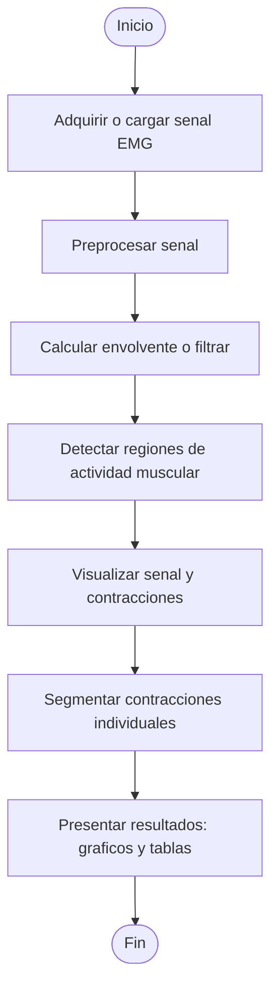
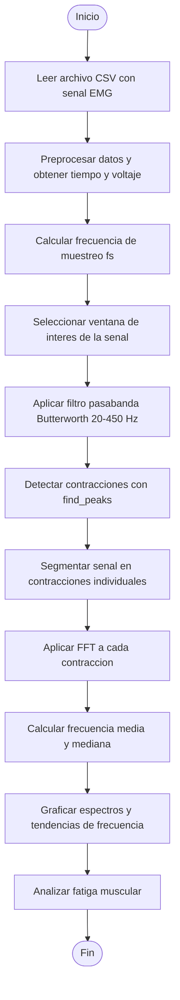
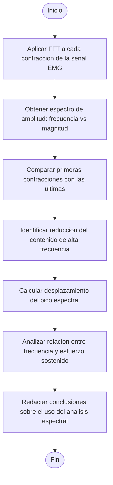

# Laboratorio-4-EMG

<h2 align="center">𝙞𝙣𝙩𝙧𝙤𝙙𝙪𝙘𝙘𝙞ó𝙣</h2>
La señal electromiográfica (EMG) permite analizar la actividad eléctrica producida por los músculos durante la contracción. Mediante su procesamiento digital es posible identificar variaciones en la amplitud y frecuencia que reflejan el estado de fatiga muscular. En esta práctica se emplean herramientas computacionales para adquirir, filtrar y analizar señales EMG, observando cómo cambia su contenido espectral a lo largo de varias contracciones.

<h2 align="center">𝙤𝙗𝙟𝙚𝙩𝙞𝙫𝙤</h2>

Analizar señales electromiográficas emuladas y reales mediante técnicas de segmentación y análisis espectral, con el fin de calcular la frecuencia media y mediana y evaluar su relación con la aparición de la fatiga muscular.

<h2 align="center">𝙞𝙢𝙥𝙤𝙧𝙩𝙖𝙘𝙞ó𝙣 𝙙𝙚 𝙡𝙞𝙗𝙧𝙚𝙧𝙞𝙖𝙨</h2>

```python
import numpy as np
import pandas as pd
import matplotlib.pyplot as plt
from scipy.signal import butter, filtfilt, welch
```
Esa parte del código muestra la importación de librerías necesarias para el procesamiento y análisis de señales EMG:

`numpy` como `np` para realizar operaciones numéricas y manejo de arreglos;
`pandas` como `pd` para cargar y manipular los datos de la señal;
 `matplotlib.pyplot ` como  `plt` para graficar los resultados y visualizar las contracciones;
y las funciones  `butter `,  `filtfilt ` y  `welch ` del módulo  `scipy.signal ` para aplicar filtros digitales y obtener el análisis espectral de la señal.

<h1 align="center"><i><b>𝐏𝐚𝐫𝐭𝐞 A 𝐝𝐞𝐥 𝐥𝐚𝐛𝐨𝐫𝐚𝐭𝐨𝐫𝐢𝐨</b></i></h1>




**visualizacion de la señal**
```python
# === Cargar señal ===
fs = 2000  # Frecuencia de muestreo
archivo = "/content/emg_data1.csv"

df = pd.read_csv(archivo)
t = df.iloc[:, 0].values
emg = df.iloc[:, 1].values

# === Graficar ===
plt.figure(figsize=(12,4))
plt.plot(t, emg, color='black')
plt.title("Señal EMG completa")
plt.xlabel("Tiempo (s)")
plt.ylabel("Amplitud")
plt.grid(True)
plt.tight_layout()
plt.show()
```
Esta parte del código se encarga de cargar y visualizar la señal electromiográfica (EMG).
Primero se define la frecuencia de muestreo (`fs = 2000`) y se especifica la ruta del archivo CSV (`archivo = "/content/emg_data1.csv"`) que contiene los datos adquiridos.
Luego, con la librería `pandas`, se utiliza `read_csv()` para leer el archivo y almacenar la información en un DataFrame.
Las columnas del archivo se asignan a dos variables: `t`, que representa el tiempo en segundos, y emg, que corresponde a la amplitud de la señal registrada.

Finalmente, se emplea `matplotlib.pyplot` para graficar la señal EMG completa, mostrando su comportamiento en el tiempo, con los ejes y título configurados para una visualización clara.
## resultado
<p align="center">

</p>

**Detección y visualización de contracciones**
```python
df = pd.read_csv(archivo)
t = df.iloc[:, 0].values
emg = df.iloc[:, 1].values

analytic = signal.hilbert(emg)
envelope = np.abs(analytic)
ventana = int(0.02 * fs)
envelope_smooth = np.convolve(envelope, np.ones(ventana)/ventana, mode='same')

# === Detección de contracciones ===
umbral = np.mean(envelope_smooth) + 0.5 * np.std(envelope_smooth)
activo = envelope_smooth > umbral
min_duracion = int(0.1 * fs)

regiones = []
en_region = False
for i in range(len(activo)):
    if activo[i] and not en_region:
        inicio = i
        en_region = True
    if not activo[i] and en_region:
        fin = i
        en_region = False
        if fin - inicio >= min_duracion:
            regiones.append((inicio, fin))
if en_region:
    fin = len(activo) - 1
    if fin - inicio >= min_duracion:
        regiones.append((inicio, fin))

# === Graficar señal con contracciones ===
plt.figure(figsize=(12,4))
plt.plot(t, emg, color='black', label='Señal EMG')
plt.plot(t, envelope_smooth, color='#E50063', alpha=0.6, label='Envolvente suavizada')
for (s, e) in regiones:
    plt.axvspan(t[s], t[e], color='#FFB6C1', alpha=0.3)
plt.title("Contracciones detectadas")
plt.xlabel("Tiempo (s)")
plt.ylabel("Amplitud")
plt.legend()
plt.tight_layout()
plt.show()
```
En esta parte del código se realiza el procesamiento de la señal EMG para detectar las contracciones musculares. Primero se carga el archivo con los datos de tiempo y amplitud, y se calcula la envolvente suavizada, la cual representa los cambios en la amplitud de la señal a lo largo del tiempo y permite identificar con mayor claridad los momentos en que el músculo se activa.
Luego, se establece un umbral que sirve como referencia para determinar cuándo la señal es lo suficientemente alta como para considerarse una contracción. A partir de ese umbral, se crea una condición que indica si la señal está activa o no. Con ayuda de las estructuras if, el programa recorre la señal punto por punto: cuando detecta que la señal supera el umbral, se marca el inicio de una contracción, y cuando vuelve a bajar, se marca el final. Si la duración de esa contracción supera un tiempo mínimo, se guarda como una región válida.
Finalmente, se grafica la señal EMG original junto con la envolvente suavizada y las zonas donde se detectaron las contracciones, destacadas con un sombreado rosado, lo que permite visualizar de forma clara los periodos de actividad y reposo del músculo.

## resultado
<p align="center">

</p>

**segmentacion de las contracciones**

```python
margen = int(0.2 * fs)
regiones = regiones[:5]
for i, (s, e) in enumerate(regiones):
    inicio = max(0, s - margen)
    fin = min(len(emg), e + margen)
    
    plt.figure(figsize=(8,3))
    plt.plot(t[inicio:fin], emg[inicio:fin], color='#FF00AA')  # señal EMG
    plt.axvspan(t[s], t[e], color='#C8A2C8', alpha=0.3, label="Contracción detectada")
    plt.title(f"Contracción {i+1}")
    plt.xlabel("Tiempo (s)")
    plt.ylabel("Amplitud")
    plt.legend()
    plt.grid(True)
    plt.tight_layout()
    plt.show()
```
Esta parte del código se encarga de mostrar de forma individual las contracciones musculares detectadas en la señal electromiográfica (EMG).
Primero, se define un margen de 200 milisegundos antes y después de cada contracción (`margen = int(0.2 * fs)`) para visualizar con mayor detalle el inicio y el final de cada una. Luego, se seleccionan las cinco primeras contracciones (`regiones = regiones[:5]`) con el fin de limitar el número de gráficas generadas.

Mediante un ciclo `for`, el programa recorre cada contracción detectada y genera una figura independiente. En cada una, se grafica la señal EMG en color fucsia, representando la variación de amplitud del músculo durante la contracción, mientras que el intervalo correspondiente a la actividad muscular se resalta con un sombreado lila para identificar claramente el momento de la contracción.
## resultado
<p align="center">


</p>

<p align="center">


</p>

<p align="center">

</p>

**calculo de frecuencia media y mediana**

```python
frecuencia_media = []
frecuencia_mediana = []

for s, e in regiones:
    segmento = emg[s:e]                      # Señal de cada contracción
    f, Pxx = welch(segmento, fs=fs, nperseg=512)  # Espectro de potencia
    Pxx_norm = Pxx / np.sum(Pxx)             # Normaliza la potencia

    f_mean = np.sum(f * Pxx_norm)            # Frecuencia media
    f_median = f[np.searchsorted(np.cumsum(Pxx_norm), 0.5)]  # Frecuencia mediana

    frecuencia_media.append(f_mean)
    frecuencia_mediana.append(f_median)

# === Mostrar resultados en tabla ===
tabla = pd.DataFrame({
    "Contracción": [f"{i+1}" for i in range(len(regiones))],
    "Frecuencia media (Hz)": np.round(frecuencia_media, 2),
    "Frecuencia mediana (Hz)": np.round(frecuencia_mediana, 2)
})

print(tabla)
```
Este código calcula la frecuencia media y mediana de cada contracción detectada en la señal EMG. Primero, se utilizan las librerías `scipy.signal`, `numpy` y `pandas` para procesar los datos. Dentro de un ciclo `for`, se recorre cada contracción y se aplica el método de Welch para obtener el espectro de potencia de la señal, representado por las frecuencias (`f`) y su energía (`Pxx`). Luego, se normaliza el espectro para calcular la frecuencia media, que indica el promedio ponderado de las frecuencias, y la frecuencia mediana, que marca el punto donde se concentra el 50 % de la energía total. Finalmente, los resultados se organizan en una tabla que muestra, para cada contracción muscular, los valores obtenidos de ambas frecuencias, facilitando el análisis de la variación en el contenido espectral de la señal.

El **método de Welch** se usa para ver cómo se distribuye la energía de una señal en diferentes frecuencias. Para hacerlo más claro: se divide la señal en partes más pequeñas, se suaviza cada parte con una ventana, se calcula el espectro de cada parte y luego se promedian todos esos espectros para obtener un resultado más estable y menos ruidoso.
## resultado


<h1 align="center"><i><b>𝐏𝐚𝐫𝐭𝐞 B 𝐝𝐞𝐥 𝐥𝐚𝐛𝐨𝐫𝐚𝐭𝐨𝐫𝐢𝐨</b></i></h1>



```python
signal = "captura_musculo.csv"
data = pd.read_csv(signal, skiprows=1, names=["Tiempo", "Voltaje"])
data["Tiempo"] = pd.to_numeric(data["Tiempo"], errors="coerce")
data["Voltaje"] = pd.to_numeric(data["Voltaje"], errors="coerce")
t = data["Tiempo"].values
emg = data["Voltaje"].values
fs = 1 / np.mean(np.diff(t))  # frecuencia de muestreo inferida del tiempo

print(f"Frecuencia de muestreo ≈ {fs:.1f} Hz")
```
Se lee la señal del EMG guardada en un .csv que anteriormente fue obtenida usando electrodos, DAQ y STlink.
```python
def butter_bandpass(lowcut, highcut, fs, order=4):
    nyq = 0.5 * fs
    low = lowcut / nyq
    high = highcut / nyq
    b, a = butter(order, [low, high], btype='band')
    return b, a
```
Se define y diseña un filtro pasabanda tipo butterworth para usar más adelante.
```python
t_inicio = 76.0
t_fin = 82.5
mask = (t >= t_inicio) & (t <= t_fin)
t_zoom = t[mask]
emg_zoom = emg[mask]

plt.figure(figsize=(12, 4))
plt.plot(t_zoom, emg_zoom, color='gray')
plt.title(f"Señal EMG cruda ({t_inicio:.1f}s - {t_fin:.1f}s)")
plt.xlabel("Tiempo [s]")
plt.ylabel("Voltaje [V]")
plt.grid(True)
plt.show()
```
<p align="center">

</p>

Se crea una ventana para fragmentar la señal completa y solo usar la parte donde se encuentran las contracciones. 
Se grafica esta señal ya recortada pero sin filtrar.

```python
b, a = butter_bandpass(20, 450, fs)
filtrada = filtfilt(b, a, emg_zoom)

plt.figure(figsize=(12, 4))
plt.plot(t_zoom, filtrada, color='b')
plt.title(f"Señal EMG filtrada (20–450 Hz) ({t_inicio:.1f}s - {t_fin:.1f}s)")
plt.xlabel("Tiempo [s]")
plt.ylabel("Voltaje [V]")
plt.grid(True)
plt.show()
```
<p align="center">

</p>

Se aplica el filtro definido anteriormente como pasabanda entre 20-450 Hz.
Se grafica esta señal recortada y filtrada.
```python
from scipy.signal import find_peaks


picos, propiedades = find_peaks(
    np.abs(filtrada),     
    height=0.05,            
    distance=fs*0.5,         
    prominence=0.02         
)

plt.figure(figsize=(12, 4))
plt.plot(t_zoom, filtrada, color='b')
plt.plot(t_zoom[picos], filtrada[picos], 'ro', label='Contracciones detectadas')
plt.title("Detección de contracciones musculares (picos EMG)")
plt.xlabel("Tiempo [s]")
plt.ylabel("Voltaje [V]")
plt.legend()
plt.grid(True)
plt.show()

print(f" Se detectaron {len(picos)} contracciones.")
```
<p align="center">

</p>

Se usa find peaks para identificar los picos (contracciones) y se grafica nuevamente la señal, pero resaltando estos picos identificados para ver su distribución y que sean correctos.

```python
ventana = int(0.5 * fs) 

segmentos = []
for pico in picos:
    inicio = max(pico - ventana, 0)
    fin = min(pico + ventana, len(filtrada))
    segmentos.append(filtrada[inicio:fin])
```
Se divide la señal entre cada una de sus contracciones para analizar individualmente.

```python
freq_medias = []
freq_medianas = []

for n, seg in enumerate(segmentos):
    N = len(seg)
    # FFT
    fft_vals = np.fft.fft(seg)
    fft_vals = np.abs(fft_vals[:N//2])  
    freqs = np.fft.fftfreq(N, 1/fs)[:N//2]

    Pxx = (fft_vals ** 2) / N

    f_mean = np.sum(freqs * Pxx) / np.sum(Pxx)     
    cumulative = np.cumsum(Pxx)
    f_median = freqs[np.where(cumulative >= cumulative[-1]/2)[0][0]]  

    freq_medias.append(f_mean)
    freq_medianas.append(f_median)

    print(f"Contracción {n+1}: Frecuencia media = {f_mean:.1f} Hz, Frecuencia mediana = {f_median:.1f} Hz")
```
Se crea un bucle donde por cada contracción se calcula la transformada de fourier, la potencia, la frecuencia media y la frecuencia mediana.
Al final se escriben los datos obtenidos para cada contracción.

```python
for n, seg in enumerate(segmentos):
    N = len(seg)
    fft_vals = np.fft.fft(seg)
    fft_vals = np.abs(fft_vals[:N//2])
    freqs = np.fft.fftfreq(N, 1/fs)[:N//2]
    Pxx = (fft_vals ** 2) / N

    plt.figure(figsize=(8,4))
    plt.plot(freqs, Pxx)
    plt.title(f'Espectro de frecuencias (FFT) - Contracción {n+1}')
    plt.xlabel('Frecuencia (Hz)')
    plt.ylabel('Potencia (a.u.)')
    plt.xlim(0, 500)
    plt.grid(True)
    plt.tight_layout()
    plt.show()
```
Se grafican individualmente los espectros de frecuencias de cada contracción.
<p align="center">


</p>
<p align="center">


</p>
 <p align="center">


</p>
  <p align="center">


</p>

```python
plt.figure(figsize=(7,4))
plt.plot(range(1, len(freq_medias)+1), freq_medias, 'o-', label='Frecuencia media')
plt.plot(range(1, len(freq_medianas)+1), freq_medianas, 's-', label='Frecuencia mediana')
plt.title('Grafica de tendencias de la frecuencia')
plt.xlabel('Número de contracción')
plt.ylabel('Frecuencia (Hz)')
plt.legend()
plt.grid(True)
plt.tight_layout()
plt.show()
```
Finalmente se grafica la tendencia de las frecuencias para analizar la fatiga y su comportamiento.
<p align="center">

</p>

En el experimento se realizaron las medidas de varias contracciones del brazo al apretar un objeto. En la grafica se muestra que las frecuencias incialmente estan en valores promedios como 40-45 Hz, lo cual corresponde a actividad muscular normal, a partir de la cuarta contracción la frecuencia tiende a disminuir, indicando cierto nivel de fatiga muscular, aunque esta reducción no es muy extrema, por lo cual se podría decir que no se alcanzó la fatiga completamente.


Los cambios en la frecuencia y la fatiga fisiologica se basan en que a lo largo de una contracción repetida, el musculo consume grandes cantidades de ATP, y como resultado se acumula acido lactico e iones de H en la fibra muscular. Este exceso de H inhibe los canales de Na y K, reduciendo la generación de potenciales de acción, y haciendo que la señal electrica viaje más lento, haciendo que las frecuencias disminuyan a medida que hay más contracciones y mas fatiga. 


<h1 align="center"><i><b>𝐏𝐚𝐫𝐭𝐞 C 𝐝𝐞𝐥 𝐥𝐚𝐛𝐨𝐫𝐚𝐭𝐨𝐫𝐢𝐨</b></i></h1>



```python
# Cargar datos
data = pd.read_csv("emg_data1.csv")

# Convertir columnas a valores numéricos
data["Tiempo [s]"] = pd.to_numeric(data["Tiempo [s]"], errors='coerce')
data["Voltaje [V]"] = pd.to_numeric(data["Voltaje [V]"], errors='coerce')

t = data["Tiempo [s]"].values
emg = data["Voltaje [V]"].values

# Frecuencia de muestreo estimada
fs = 1 / np.mean(np.diff(t))
N = len(emg)
print(f"Frecuencia de muestreo estimada: {fs:.2f} Hz")

# FFT
frecuencias = fftfreq(N, 1/fs)
fft_emg = fft(emg)
amplitud = np.abs(fft_emg) / N

# Gráfica señal original
plt.figure(figsize=(10,3))
plt.plot(t, emg, color='blue')
plt.title("Señal EMG original en el tiempo")
plt.xlabel("Tiempo [s]")
plt.ylabel("Voltaje [V]")
plt.grid(True)
plt.show()

```


Frecuencia de muestreo estimada: 2000.00 Hz

```python
# --- b) Gráfica del espectro de amplitud ---

plt.figure(figsize=(10,4))
plt.plot(frecuencias[:N//2], amplitud[:N//2])
plt.title("Espectro de amplitud (Frecuencia vs Magnitud)")
plt.xlabel("Frecuencia [Hz]")
plt.ylabel("Amplitud")
plt.grid(True)
plt.show()
```


```python
mitad = N // 2
segmento1 = emg[:mitad]
segmento2 = emg[mitad:]

fft_seg1 = np.abs(fft(segmento1)) / len(segmento1)
fft_seg2 = np.abs(fft(segmento2)) / len(segmento2)
f_seg = fftfreq(len(segmento1), 1/fs)

plt.figure(figsize=(10,4))
plt.plot(f_seg[:len(f_seg)//2], fft_seg1[:len(f_seg)//2], label="Primeras contracciones", color='blue')
plt.plot(f_seg[:len(f_seg)//2], fft_seg2[:len(f_seg)//2], label="Últimas contracciones", color='orange', alpha=0.7)
plt.title("Comparación: primeras vs últimas contracciones")
plt.xlabel("Frecuencia [Hz]")
plt.ylabel("Amplitud")
plt.legend()
plt.grid(True)
plt.show()
```


```python
energia_alta_1 = np.sum(fft_seg1[int(len(f_seg)*0.25):])
energia_alta_2 = np.sum(fft_seg2[int(len(f_seg)*0.25):])

plt.figure(figsize=(6,4))
plt.bar(["Inicio", "Final"], [energia_alta_1, energia_alta_2], color=['blue','orange'])
plt.title("Energía en altas frecuencias")
plt.ylabel("Energía relativa")
plt.grid(axis='y')
plt.show()

print(f"Energía altas frecuencias (inicio): {energia_alta_1:.4f}")
print(f"Energía altas frecuencias (final): {energia_alta_2:.4f}")

if energia_alta_2 < energia_alta_1:
    print("Se reduce el contenido de alta frecuencia → posible fatiga muscular.")
else:
    print("No hay reducción significativa en altas frecuencias.")
```


```python
Energía altas frecuencias (inicio): 7.7270
Energía altas frecuencias (final): 7.7534
No hay reducción significativa en altas frecuencias.

```

```python
pico_inicial = f_seg[np.argmax(fft_seg1[:len(f_seg)//2])]
pico_final = f_seg[np.argmax(fft_seg2[:len(f_seg)//2])]

plt.figure(figsize=(10,4))
plt.plot(f_seg[:len(f_seg)//2], fft_seg1[:len(f_seg)//2], label=f"Inicio (pico {pico_inicial:.1f} Hz)", color='blue')
plt.plot(f_seg[:len(f_seg)//2], fft_seg2[:len(f_seg)//2], label=f"Final (pico {pico_final:.1f} Hz)", color='orange', alpha=0.7)
plt.axvline(pico_inicial, color='blue', linestyle='--')
plt.axvline(pico_final, color='orange', linestyle='--')
plt.title("Desplazamiento del pico espectral")
plt.xlabel("Frecuencia [Hz]")
plt.ylabel("Amplitud")
plt.legend()
plt.grid(True)
plt.show()

print(f"Pico espectral inicial: {pico_inicial:.2f} Hz")
print(f"Pico espectral final: {pico_final:.2f} Hz")

if pico_final < pico_inicial:
    print("El pico espectral se desplazó hacia frecuencias bajas → esfuerzo sostenido.")
else:
    print("No se observa desplazamiento hacia bajas frecuencias.")
```


```python
Pico espectral inicial: 4.00 Hz
Pico espectral final: 4.00 Hz
No se observa desplazamiento hacia bajas frecuencias.


Conclusiones:

El análisis espectral mediante la Transformada Rápida de Fourier (FFT)
permite observar cómo el contenido en frecuencia de la señal EMG cambia
durante el esfuerzo muscular. 

Una disminución de energía en altas frecuencias y el desplazamiento del pico
hacia frecuencias más bajas son indicadores de fatiga muscular. 

Por tanto, la FFT es una herramienta diagnóstica útil en electromiografía
para evaluar la condición del músculo y su comportamiento ante esfuerzos sostenidos.
```
